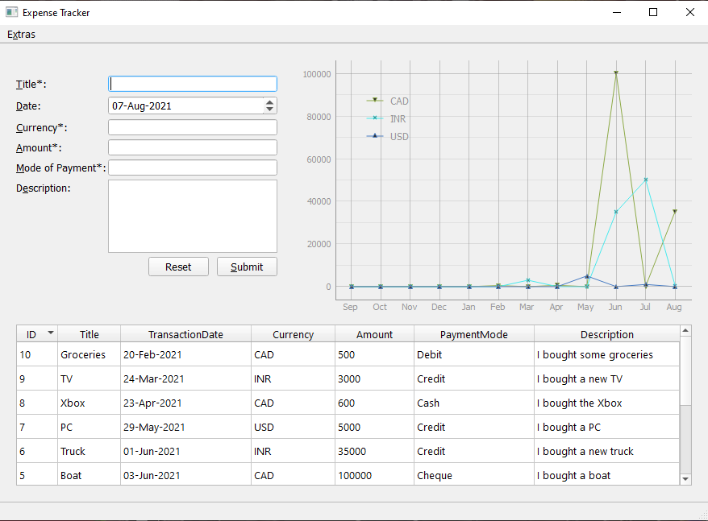

# Description 
This is a GUI program made with python and PyQt5. It helps you keep track of all your expenses. 
You provide the details and it stores them in a sqlite3 table. 
It provides the basic CRUD operations one needs. 
It also provides you with a visualization of your spending in the past year. 

## Image

## How to use 

All input fields have shortcuts and the buttons have a tab order: Title -> Date -> Currency -> Amount -> Mode of Payment -> Description -> Submit -> Reset -> Database Table at the bottom 

For importing csv files, 
The headers should be:  
_ID, Title, TransactionDate, Currency, Amount, PaymentMode and Description_  
  
**TransactionDate must be in short form i.e., dd-mm-yyyy**  
**Amount must be numbers**

Description can hold paragraphs but if you export the data to csv and import it into Excel, You need to select the Description column and select the *Wrap Text* option 

#### Shortcuts 
* Jump to Title: 			Alt + T 
* Jump to Date:  			Alt + D
* Jump to Currency: 		Alt + C 
* Jump to Amount:       	Alt + A
* Jump to Mode of Payment: 	Alt + E
* Press Submit:				Alt + S 
* Extra Menu: 				Alt + X
* Refresh: 					Alt + F 			

*Deleting Records:* The option to delete records is available in the **Extras** menu. Entering "1-5,7" deletes records with IDs: 1,2,3,4,5 and 7.  
*Graph:* You can turn individual currencies on/off by pressing on the currencies in the legend of the plot.  

## Files: 
* Expense Tracker.exe: This is the standalone .exe file. If you are interested in using the program, you can download this and run it. The database will be stored in the same directory as the .exe  
* Expense Tracker.py: This is the .py version of the executable file.  
* main.py and UI.ui: UI.ui is the GUI made with Qt Designer and main.py loads UI.ui and provides functionality to the GUI.  
* Pipfile and Pipfile.lock: If you are interested in recreating the environment in which the .py files can be run, use these two files.   
